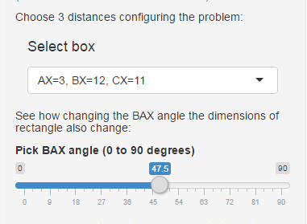

---
title       : Geometric Shiny Application
subtitle    : Maximum and minimum rectangles' areas keepping constant distances from an interior point to 3 vertices. 
author      : A.Casares M.
job         :
framework   : io2012       # {io2012, html5slides, shower, dzslides, ...}
highlighter : highlight.js  # {highlight.js, prettify, highlight}
hitheme     : tomorrow      # 
widgets     : [mathjax]            # {mathjax, quiz, bootstrap}
mode        : selfcontained # {standalone, selfcontained, draft}
knit        : slidify::knit2slides

--- &twocol

## The original problem and the actual data:

*** =left

```{r fig1, echo=FALSE}
        trios <- data.frame(matrix(c(3,3,2,2,1,5,4,3,12,9,10,7,9,13,16,13,11,7,5,6,8,9,7,6),ncol=3))
        names(trios) <- c("AX","BX","CX")
        # sel <- sample(1:8, 1)
        # r <- trios[sel,1]
        # BX <- trios[sel,2]
        # CX <- trios[sel,3]
        # alfa <- sample(20:70,1)
        sel = 2
        AX <- r <- trios[sel,1]
        BX <- trios[sel,2]
        CX <- trios[sel,3]
        alfa <- sample(20:70,1)
        rad <- alfa * pi/180
        y <- r * sin(rad)
        x <- r * cos(rad)
        # Rectangle base:
        b <- sqrt(BX^2 - y ^ 2) + x
        # Rectangle height:
        h <- sqrt(CX^2 - x ^ 2) + y
        d <- sqrt(BX^2 + CX^2 - r^2)
        plot.new()
        plot(c(-1, 26), c(-1, 15), 
            xlab = paste("Base = ", sprintf("%5.3f", b)),
            ylab = paste("Heigth = ", sprintf("%5.3f", h)))

        area <- as.character(round(b * h,3))
        rect(0, 0, b, h, lwd = 1.5)
        points(x, y, pch = 19, col = "blue")
        lines(c(0,x,x,0,x,b),c(0,y,y,h,y,0),col="blue")
        lines(c(x,b),c(y,h),col="red")
        text(3,.5,sprintf("BAX = %4.1f",alfa))
        text(x+.1,y+.6,'X',col="red")
        text(-.4,.0,'A');text(b+.4,.0,'B')
        text(-.4,h,'C');text(b+.4,h,'D')
        text(b/2,h+1,sprintf('DX found = %2.0f',d))
        leg.txt <- c("      Data:          ",
                     sprintf(" r = AX = %d",r),
                     sprintf(" BX = %d",BX),
                     sprintf(" CX = %d",CX)
        )
        legend(b+1,15,leg.txt)
        title(main = "Fig.1")
```     

*** =right

**Given distances AX, BX and CX, is the 4th distance DX determined?**  

- Answer: Yes, with Pythagoras'  help.    

For instance:    
Let BX = 9, CX = 7, AX = 3    

$DX = \sqrt{BX^2+CX^2-AX^2}$    

```{r, calculo}
# Running the corresponding R code:
  DX <- sqrt(BX^2+CX^2-AX^2)
  cat(sprintf('DX = %3.1f',DX))
```

--- &twocol

## The general question: extreme areas' values    

*** =left

### For a given set of distances: 

The point X is allowed to move only along a circle with r = AX and center A.

When X moves, the rectangle adjusts its dimensions to keep the distances.



*** =right

<br>
<br>
<br>
**To see it and examine the  problem's behaviour, the application allows you:**    
- To choose the three data distances in a select box.
- And vary the polar angle $BAX = \alpha$, that sets the position of point X, through a slider control.
- The figures react to these changes. You can see how the area keeps changing.
<br>
<br>
**Between what limits?**

--- &twocol

## Curve of areas as function of polar angle BAX.

*** =left

```{r fig2, echo=FALSE}
trios <- data.frame(matrix(c(3,3,2,2,1,5,4,3,12,9,10,7,9,13,16,13,11,7,5,6,8,9,7,6),ncol=3))
        names(trios) <- c("AX","BX","CX")
        alf <- seq(0,90,0.1)
        A <- sapply(alf, function(x){
                    rad <- x*pi/180
                    y <- r * sin(rad)
                    x <- r * cos(rad)
                    b <- sqrt(BX^2 - y ^ 2) + x
                    h <- sqrt(CX^2 - x ^ 2) + y
                    b*h
                 })
        mxA <- max(A); mnA <- min(A)
        ind_max <- which.max(A)
        ang_max <- alf[ind_max]
        rng <- mxA - mnA
        rad <- ang_max * pi/180
        y <- r * sin(rad)
        x <- r * cos(rad)
        lx <- round(sqrt(BX^2 - y ^ 2) + x,3)
        ly <- round(sqrt(CX^2 - x ^ 2) + y,3)
        plot(alf,A,type = 'l',col = 'blue',
             xlab = "Angle (degrees)", ylab = "Area (m^2)")
        grid(11,7)
        # abline(v = input$alfa,col = "green")
        title(main = "Find the maximum possible area:")
        y1 <- mnA+rng/2; y2 <- y1-rng/10; y3 <- y2-rng/10
        text(50,y1,paste("Greatest Area = ",round(mxA,5)))
        text(50,y2,paste("At angle =", ang_max))
        text(50,y3,paste("(",lx,"x",ly,")"))
        text(18,mnA,paste("Shortest Area = ",round(mnA,5)))
```        

*** =right

### Empirical procedure:

- Areas are computed in each point of an uniform sample. 

- The extreme areas may be easily found from it. 

- The figure shows the answers for a set of 901 distances

- The minimum value of the area is at polar angle $BAX$ = 0 degrees.

--- &twocol w1:60% w2:40% 

## Analytical - Numerical Procedure 

*** =left

**To analytically find the function and its derivative is a hard and boring work to do.**
```{r fig3, echo=FALSE}
        dx <- 0.1;alf <- seq(0,90,dx)
        A <- sapply(alf, function(x){
            rad <- x*pi/180
            y <- r * sin(rad)
            x <- r * cos(rad)
            b <- sqrt(BX^2 - y ^ 2) + x
            h <- sqrt(CX^2 - x ^ 2) + y
            b*h
        })
        grad <- matrix(0,length(alf),ncol = 1)
        for (i in 2:(length(alf)-1)){
            grad[i,1] <- (A[i+1]-A[i-1])/(2*dx)
        }
        grad[1,1] <- grad[2,1]
        grad[length(alf),1] <- grad[length(alf)-1,1]
        mxG <- max(grad)
        datos <- data.frame(alf,grad); names(datos) <- c('alfa','deriv')
        plot(alf,grad, type = 'l',col = 'blue',
             xlab = "alpha", ylab = "y = d(Area)/d(alpha)")
        grid(11,7)
        abline(h = 0, col = "black")
        title(main = "Numerical derivative d(Area)/d(alpha) as function of alpha:")
        # Linear model fitting:
        recta <- lm(datos$deriv ~ datos$alfa)
        coeffic <- summary(recta)$coef
        allc <- summary(recta)
        preds <- predict.lm(recta)
        lines(alf,preds, type = 'l', col = 'magenta')
        root <- -coeffic[1,1]/coeffic[2,1]
        y1 <- .765*mxG; dy <- .12*mxG; y2 <- y1-dy; y3 <- y2-dy; y4 <- y3-1.4*dy
        text(69.5,y1,sprintf('Regression line: y = %7.5f alfa + %7.5f',coeffic[2,1],
                             coeffic[1,1]))
        text(63.3,y2,sprintf('Adjusted R-squared: %6.4f',allc$adj.r.squared))
        text(70,y3,sprintf('Root of d(Area)/d(alpha) = 0: %7.4f degrees',root))
        rad <- root*pi/180
        y <- r * sin(rad)
        x <- r * cos(rad)
        b <- sqrt(BX^2 - y ^ 2) + x
        h <- sqrt(CX^2 - x ^ 2) + y
        great <-b*h
        text(68.3,y4,sprintf('Greatest Area now computed: %10.5f\n',great))

```   

*** =right

- In accordance to Calculus, at the extremes of a function its derivative is zero.

- We'll look for angles making the derivative null, without using the cumbersome function. 

- Through numerical derivatives, shown in blue, that exhibit good linear pattern.

- Thus, a linear model (*magenta*) fits them with high R-squared, crossing the X axis at almost the same point.

- Answers are practically identical, and close to empirical ones.
