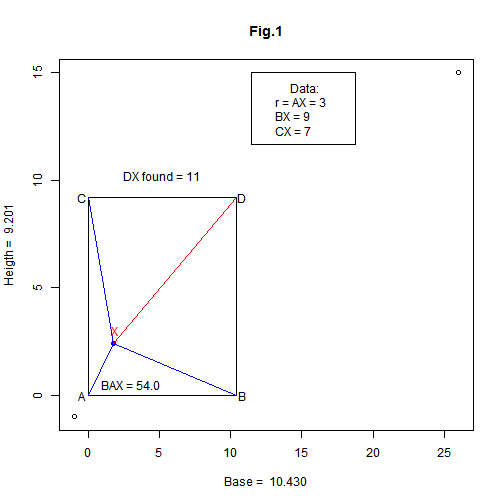
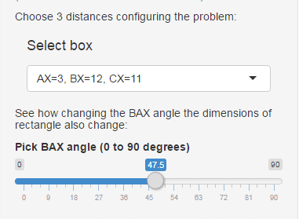

---
title       : Geometric Shiny Application
subtitle    : Maximum and minimum rectangles' areas keepping constant distances from an interior point to 3 vertices. 
author      : A.Casares M.
job         : 
framework   : io2012       # {io2012, html5slides, shower, dzslides, ...}
highlighter : highlight.js  # {highlight.js, prettify, highlight}
hitheme     : tomorrow      # 
widgets     : [mathjax]            # {mathjax, quiz, bootstrap}
mode        : selfcontained # {standalone, selfcontained, draft}
knit        : slidify::knit2slides

--- &twocol

## The original problem and the actual data:

*** =left



*** =right

**Given AX, BX and CX, is the 4th distance DX determined?**  

- Answer: Yes, with Pythagoras'  help.    

For instance:    
Let BX = 9, CX = 7, AX = 3    

$DX = \sqrt{BX^2+CX^2-AX^2}$

```r
  DX <- sqrt(BX^2+CX^2-AX^2)
  cat(sprintf('DX = %3.1f',DX))
```

```
## DX = 11.0
```

--- &twocol

## The general question: extreme values of the areas    

*** =left

### For a given set of distances: 

The point X moves only along a circle with   r=AX and center   A.

When X moves, the rectangle adjusts its dimensions to keep the distances.



*** =right

<br>
<br>
<br>
**To see it and examine the  problem's behaviour, the application allows you:**    
- To choose the three data distances in a select box.
- And vary the polar angle $BAX = \alpha$, that sets the position of point X, through a slider control.
- The figures react to these changes. You can see how the area keeps changing.
<br>
<br>
**Between what limits?**

--- &twocol

## Curve of areas as function of polar angle BAX.

*** =left

<br>
<br>


*** =right

### Empirical procedure:

- Areas computed in each point of an uniform sample. 

- The extreme areas may be easily computed from it. 

- The figure shows the answers for a set of 901 distances

- The minimum value of the area is at polar angle BAX = 0 degrees.

--- &twocol  

## Analytical - Numerical Procedure 

*** =left

**Finding the analytical function and its derivative is hard to do.**
<br>


*** =right

- In accordance to Calculus, at the extremes of a function its derivative is zero.

- We'll look for angles making the derivative null, without using the cumbersome function. 

- Through numerical derivatives, shown in blue, that exhibit good linear pattern.

- Thus, a linear model (*magenta*) fits them with high R-squared, crossing the X axis at almost the same point.

- Answers are practically identical, and close to empirical ones.


